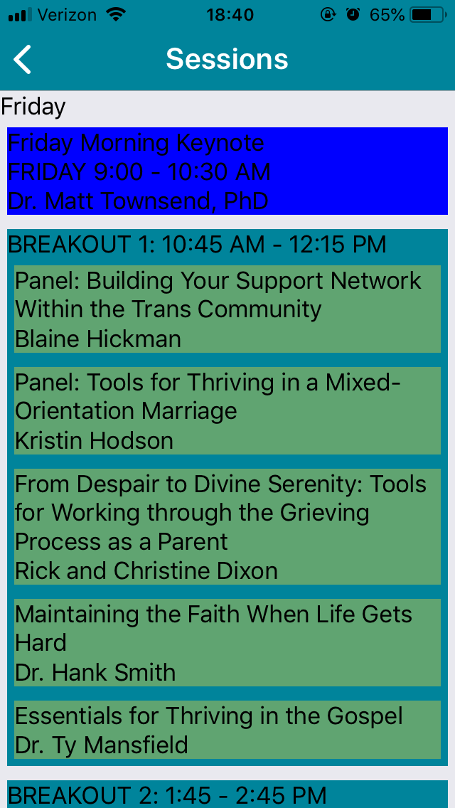
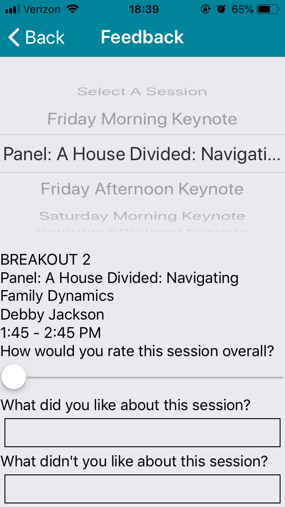

# North Star Conference App - 2019

## Design Questions

- Feedback
    - Should we have a starting page for them to select a session and then push them to the form page?
    - Or should they select the session at the top of the form page?
    - When they have successfully submitted their feedback, how do we let them know it worked?
- Should we have a search feature to search through the sessions?
    - On the Sessions, and Feedback pages
- Should we add other events to the schedule?
    - Thursday night activity
    - Sunday morning testimony meeting
- Map
    - I still need the map
- Need designs for the following pages:
    - Schedule
    - Session Details
    - Speaker Details
    - Sessions
    - Feedback
- Notifications
    - JJ is working on getting notifications working
    - I am not sure how the page functions or what information needs to be displayed
    - However, we may be able to make a design for the page without that information

## Screenshots

Obviously these are not designed/styled yet. I just built them to get the information to display in the correct format. When I have designs for each page, I'll style them after the design.

### Home

### Schedule

Click on an empty time slot to select a session for it.

#### Select Breakout (for schedule)

Click on a session to select it.

#### Session Info

Click Add/Remove to/from Schedule to update schedule.

Click Provide Feedback to give feedback.

Click speaker name to view speaker info.

#### Speaker Info

### All Sessions

### Feedback

Instead of having the selection at the top, I think we will have a slide-up page to select a session.

The slide-up will automatically slide up if there is no session selected (this happens when they click directly on Feedback from the Home page instead of from the Session Info page).

### Notifications

...

### Map

...
